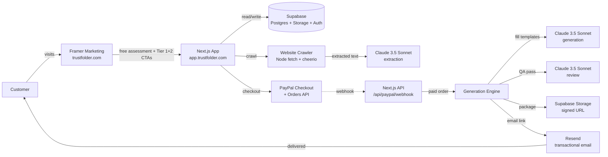

# 05 · Tech Architecture · Stack + Data Flow

The end-to-end technical setup: Framer marketing site + Next.js product app + Supabase backend + PayPal payments + Claude/GPT-4 AI engine + Resend email. All on free tiers initially.

---

## High-level architecture



---

## Tech stack table

| Layer | Tool | Why this choice | Cost |
|---|---|---|---|
| Marketing site | **Framer** | Premium feel, no engineering overhead, fast iteration on copy/design | $0-15/mo |
| Product app | **Next.js 14 App Router** | Server actions + API routes + Vercel-native deploy | $0 (Vercel free tier) |
| UI library | **shadcn/ui + Tailwind** | Copy-paste components, full design control, no lock-in | $0 |
| Design assistance | **Huashu Design (skill)** | Generate hero variants + premium visuals via AI prompts | $0 |
| AI engine | **Claude 3.5 Sonnet (primary) + GPT-4 (fallback)** | Best-in-class for structured generation; redundancy if outage | ~$3-5/order |
| Website crawler | **Node fetch + cheerio** | Simple, reliable, low-cost (vs Playwright); upgrade if needed | ~$0.50/order |
| Database | **Supabase** | Postgres + Storage + Auth in one product, generous free tier | $0 free tier |
| Payments | **PayPal Checkout + Orders API + Webhooks** | Avoids Stripe-India domestic limits; works for international buyers | 4.4% + $0.30 per txn |
| Email delivery | **Resend** | Developer-friendly transactional email API, 3k free/mo | $0 |
| File storage | **Supabase Storage** | Signed URLs, free tier covers first 100+ customers | <$1/mo |
| Domain | **Namecheap or Cloudflare** | Cheap, reliable | $10-15/yr |
| Hosting | **Vercel free tier** | Auto-deploy, edge network, generous limits | $0 |
| Motion graphics (later) | **Remotion** | React-native MP4 generation | Phase 6 |

**Mo-1 fixed costs:** ~$15/mo  
**Variable per order (Tier 2):** ~$5 (Claude API) + $22 (PayPal fee) = ~$27 net cost on $499 = **94% margin**

---

## Subdomain split

| Domain | Stack | Purpose |
|---|---|---|
| `trustfolder.com` | Framer | Marketing landing, pricing, blog, FAQ, regulatory watch |
| `app.trustfolder.com` | Next.js on Vercel | Product app: assessment, questionnaires, checkout, dashboard |
| `api.trustfolder.com` (or `app.trustfolder.com/api`) | Next.js API routes | Backend: crawler, engine, webhooks, deliveries |

**DNS setup:**
- Apex `trustfolder.com` → Framer (CNAME or A record per Framer instructions)
- `app.trustfolder.com` → Vercel (CNAME)
- Subdomains managed in DNS provider (Namecheap or Cloudflare DNS)

---

## Database schema (Supabase Postgres)

```sql
-- Leads (free assessment + waitlist)
CREATE TABLE leads (
  id UUID PRIMARY KEY DEFAULT gen_random_uuid(),
  email TEXT NOT NULL,
  url TEXT,
  source TEXT, -- 'free_assessment' | 'waitlist_tier2' | 'newsletter'
  classification TEXT, -- 'limited_risk' | 'unclear' | 'out_of_scope'
  extraction_data JSONB, -- crawler output
  questionnaire_data JSONB, -- 8-question answers
  created_at TIMESTAMP DEFAULT NOW(),
  UNIQUE(email, source)
);

-- Orders (paid tiers)
CREATE TABLE orders (
  id UUID PRIMARY KEY DEFAULT gen_random_uuid(),
  email TEXT NOT NULL,
  url TEXT NOT NULL,
  tier TEXT NOT NULL, -- 'tier_1' | 'tier_2'
  amount_cents INT NOT NULL,
  currency TEXT DEFAULT 'usd',
  paypal_order_id TEXT UNIQUE,
  payment_status TEXT, -- 'pending' | 'completed' | 'failed' | 'refunded'
  questionnaire_data JSONB,
  scope_check_passed BOOLEAN,
  created_at TIMESTAMP DEFAULT NOW(),
  paid_at TIMESTAMP
);

-- Generations
CREATE TABLE generations (
  id UUID PRIMARY KEY DEFAULT gen_random_uuid(),
  order_id UUID REFERENCES orders(id),
  status TEXT, -- 'queued' | 'generating' | 'qa' | 'completed' | 'failed'
  api_cost_cents INT,
  duration_ms INT,
  output_path TEXT, -- Supabase Storage path
  qa_score INT, -- 0-100
  qa_flags JSONB, -- list of issues
  delivered_at TIMESTAMP,
  created_at TIMESTAMP DEFAULT NOW()
);

-- Application requests (Tier 3)
CREATE TABLE applications (
  id UUID PRIMARY KEY DEFAULT gen_random_uuid(),
  email TEXT NOT NULL,
  company_name TEXT,
  company_size TEXT,
  vertical TEXT,
  ai_use_case TEXT,
  trigger TEXT,
  timeline TEXT,
  status TEXT, -- 'pending' | 'qualified' | 'rejected' | 'converted'
  created_at TIMESTAMP DEFAULT NOW()
);
```

**Migrations:** Stored in `engine/supabase/migrations/` as timestamped SQL files.

---

## AI engine pipeline

### Phase A: URL crawl + extract
```typescript
// engine/src/crawler.ts
async function crawl(url: string) {
  const pages = ['/', '/pricing', '/about', '/docs'];
  const results = await Promise.all(
    pages.map(p => fetch(`${url}${p}`).catch(() => null))
  );
  // cheerio parse each page
  // return { title, description, headings, body_text } per page
}

// engine/src/extract.ts
async function extract(crawlResult: CrawlResult) {
  const prompt = buildExtractionPrompt(crawlResult);
  const response = await claude.messages.create({
    model: 'claude-3-5-sonnet-20241022',
    max_tokens: 2000,
    system: 'You extract structured product info from website content.',
    messages: [{ role: 'user', content: prompt }],
    response_format: 'json'
  });
  return JSON.parse(response.content[0].text);
  // returns { company_name, ai_features[], target_users, b2b_or_b2c, ... }
}
```

### Phase B: Scope check
```typescript
// engine/src/scope-check.ts
function scopeCheck(extraction: Extraction, answers: Answers): ScopeResult {
  // Hard-coded keyword detection (no LLM judgment)
  const blockedKeywords = [
    'banking', 'lending', 'credit_score', 'underwriting',
    'medical', 'patient', 'diagnosis', 'health_record',
    'recruiting', 'hiring', 'cv_screening',
    'biometric_id', 'face_recognition',
    'children', 'minor', 'k12',
    'law_enforcement', 'predictive_policing',
    // ... full list
  ];
  
  const matches = blockedKeywords.filter(kw => 
    JSON.stringify({ extraction, answers }).toLowerCase().includes(kw)
  );
  
  return {
    in_scope: matches.length === 0,
    matched_keywords: matches,
    classification: matches.length === 0 ? 'in_scope' : 'out_of_scope'
  };
}
```

### Phase C: Generate (per template)
```typescript
// engine/src/generate.ts
async function generateDoc(
  template: TemplateSpec,
  context: GenerationContext
): Promise<GeneratedDoc> {
  const prompt = buildGenerationPrompt(template, context);
  const response = await claude.messages.create({
    model: 'claude-3-5-sonnet-20241022',
    max_tokens: 4000,
    system: SYSTEM_FILL_PROMPT,
    messages: [{ role: 'user', content: prompt }]
  });
  
  return {
    template_id: template.id,
    content: response.content[0].text,
    confidence_band: extractConfidenceBand(response),
    citations: extractCitations(response)
  };
}
```

### Phase D: QA pass
```typescript
// engine/src/qa.ts
async function qa(docs: GeneratedDoc[]): Promise<QAResult> {
  const prompt = buildQAPrompt(docs);
  const response = await claude.messages.create({
    model: 'claude-3-5-sonnet-20241022',
    max_tokens: 2000,
    system: SYSTEM_QA_PROMPT,
    messages: [{ role: 'user', content: prompt }]
  });
  
  return {
    score: parseScore(response),
    flags: parseFlags(response),
    pass: parseScore(response) >= 80
  };
}
```

### Phase E: Package
```typescript
// engine/src/package.ts
async function packageDocs(docs: GeneratedDoc[], orderId: string) {
  const zip = new JSZip();
  
  // Add each doc as both .md (Notion-importable) and .pdf
  for (const doc of docs) {
    zip.file(`${doc.filename}.md`, doc.content);
    zip.file(`${doc.filename}.pdf`, await mdToPdf(doc.content));
  }
  
  zip.file('README.md', buildReadme(docs));
  
  const buffer = await zip.generateAsync({ type: 'nodebuffer' });
  const path = `orders/${orderId}/pack.zip`;
  
  await supabase.storage.from('deliveries').upload(path, buffer);
  
  return supabase.storage.from('deliveries').createSignedUrl(path, 86400 * 7); // 7 days
}
```

### Phase F: Deliver
```typescript
// engine/src/deliver.ts
async function deliver(orderId: string, signedUrl: string) {
  const order = await supabase.from('orders').select('*').eq('id', orderId).single();
  
  await resend.emails.send({
    from: 'noreply@trustfolder.com',
    to: order.email,
    subject: 'Your AI Governance Readiness Pack is ready',
    html: buildDeliveryEmail(order, signedUrl)
  });
  
  await supabase.from('generations').update({ delivered_at: new Date() }).eq('order_id', orderId);
}
```

---

## PayPal integration

### Order creation (frontend → backend → PayPal)
```typescript
// app/api/paypal/create-order/route.ts
export async function POST(req: Request) {
  const { tier, email, url, questionnaire_data } = await req.json();
  
  // 1. Create internal order record (status: pending)
  const order = await supabase.from('orders').insert({
    email, url, tier, questionnaire_data,
    amount_cents: tier === 'tier_1' ? 9900 : 49900,
    payment_status: 'pending'
  }).select().single();
  
  // 2. Create PayPal order
  const paypalOrder = await paypal.orders.create({
    intent: 'CAPTURE',
    purchase_units: [{
      amount: { value: tier === 'tier_1' ? '99.00' : '499.00', currency_code: 'USD' },
      custom_id: order.data.id // link back to our order
    }]
  });
  
  // 3. Update with PayPal order ID
  await supabase.from('orders').update({ paypal_order_id: paypalOrder.id }).eq('id', order.data.id);
  
  return Response.json({ orderId: paypalOrder.id });
}
```

### Webhook handler (PayPal → backend)
```typescript
// app/api/paypal/webhook/route.ts
export async function POST(req: Request) {
  // Verify webhook signature
  const valid = await verifyPaypalSignature(req);
  if (!valid) return new Response('Unauthorized', { status: 401 });
  
  const event = await req.json();
  
  if (event.event_type === 'PAYMENT.CAPTURE.COMPLETED') {
    const orderId = event.resource.custom_id;
    
    // Update order
    await supabase.from('orders').update({
      payment_status: 'completed',
      paid_at: new Date()
    }).eq('id', orderId);
    
    // Trigger generation (async, fire-and-forget)
    triggerGeneration(orderId);
  }
  
  return new Response('OK');
}
```

---

## Frontend questionnaire flow (Next.js)

### Multi-step form using shadcn
```typescript
// app/components/QuestionnaireFlow.tsx
'use client';

const [step, setStep] = useState(1);
const [data, setData] = useState({});
const [extraction, setExtraction] = useState(null);

// Step 1: URL + email
// Step 2: Show loading + call /api/extract → setExtraction
// Step 3: Pre-filled form with editable fields
// Step 4: Scope check via /api/scope-check
// Step 5: PayPal button
```

---

## Resend email templates

Stored as React components in `app/emails/`:

- `OrderConfirmation.tsx`
- `Tier0Delivery.tsx` (free assessment PDF)
- `Tier1Delivery.tsx` (disclosure ZIP)
- `Tier2Delivery.tsx` (readiness pack)
- `OutOfScopeRefund.tsx`
- `FollowUp24Hr.tsx`
- `FollowUp7Day.tsx`
- `FollowUp30Day.tsx`

Use `@react-email/components` for consistent rendering.

---

## Environment variables

```env
# .env.local (NOT committed)
ANTHROPIC_API_KEY=sk-ant-...
OPENAI_API_KEY=sk-... (fallback)

NEXT_PUBLIC_SUPABASE_URL=https://...
NEXT_PUBLIC_SUPABASE_ANON_KEY=...
SUPABASE_SERVICE_ROLE_KEY=... # server-only

PAYPAL_CLIENT_ID=...
PAYPAL_CLIENT_SECRET=...
PAYPAL_WEBHOOK_ID=...
PAYPAL_ENV=sandbox # or 'production'

RESEND_API_KEY=re_...
RESEND_FROM_EMAIL=noreply@trustfolder.com

NEXT_PUBLIC_APP_URL=https://app.trustfolder.com
```

---

## Deployment

```bash
# Vercel CLI deploy
cd app/
vercel
vercel --prod

# Connect domain in Vercel dashboard
# trustfolder.com → Framer (apex)
# app.trustfolder.com → Next.js (subdomain)

# Supabase setup
# Create project → grab keys → run migrations
supabase db push
```

---

## Monitoring

Mo-1 minimum:
- Vercel logs (free)
- Supabase dashboard (free)
- Resend delivery logs (free)
- Manual daily check of `orders` + `generations` tables

Mo-2+:
- Add Sentry for error tracking ($0 free tier)
- Add Posthog for product analytics ($0 free tier)
- Add LogSnag for revenue notifications ($0 free tier)

---

## Backup + disaster recovery

- **Code:** GitHub private repo (push daily)
- **Database:** Supabase auto-backup (free tier daily backup)
- **Templates:** Git-tracked under `templates/` (the most precious asset)
- **Customer data:** Stripe webhook + Resend webhook → backup to a Supabase audit table

---

## Living document

Updated whenever:
- A stack component is replaced or upgraded
- A new integration is added
- Performance or cost characteristics change

Last updated: 8 May 2026 (Day 0)
